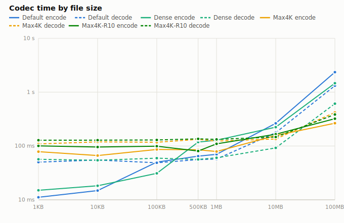
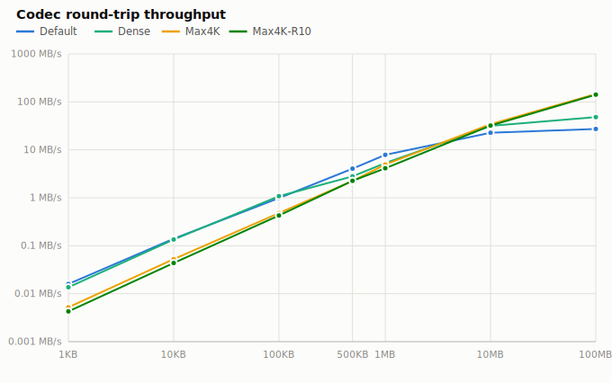
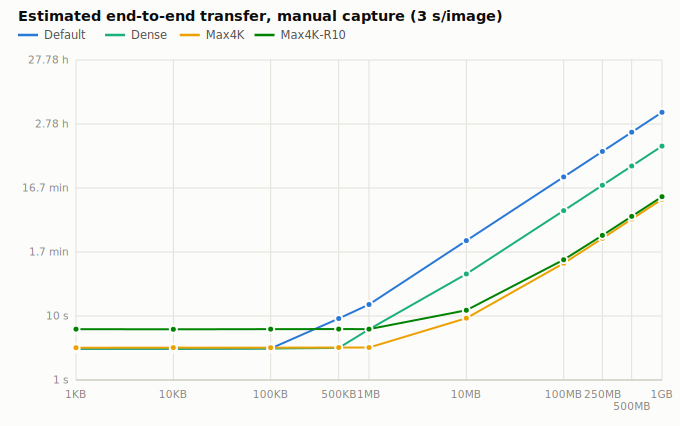
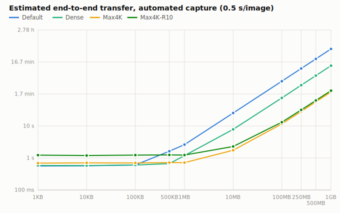

# QrShard

[](https://github.com/lfarrand/QrShard/actions/workflows/ci.yml)

QrShard transfers files between machines through the screen: it encodes any file (or folder)
into a series of high-density, QR-style images which are displayed on one machine, captured on
another — by screenshot, phone photo, screen recording, or a live webcam — and reconstituted
back into the original file, **bit-for-bit, verified by SHA-256**.

The image format is custom (not QR-standard) and tuned for screen-to-screenshot transfer.
Because a screenshot is a lossless pixel copy, each image can be vastly denser than a real QR
code: from ~212 KB per image at the robust default up to **~6.5 MB per image** on a 4K display —
so a 100 MB file fits in 22 screenshots and a 300 MB zip in ~65. Layered error correction
(including errors-and-erasures Reed-Solomon fed by the classifier's own confidence) absorbs
cursors, pop-ups, and re-encoding; parity or fountain-coded images let whole captures be lost
and rebuilt; multiple failed photos of the same image can be *fused* into a good one; payloads
can be AES-256-GCM encrypted end to end.

**Contents:** [Platforms](#supported-platforms) · [Install](#installing) ·
[How to use](#how-to-use-it) · [Options](#commands-and-options) ·
[Workflow tools](#workflow-tools-sessions-watch-verify-heatmap-calibrate) ·
[Configuration](#configuration-appsettingsjson) · [Capacity](#capacity-and-throughput) ·
[Formats](#image-formats) · [Resilience](#resilience) · [Camera capture](#camera-capture) ·
[Benchmarks](#benchmark-snapshot) · [Design notes](#how-it-works) ·
[Building & testing](#building-and-testing)

## Supported platforms

The codec is pure managed .NET 10 — no native dependencies — and the wire format is
platform-agnostic by construction, so shards encoded on one OS decode on any other (verified:
Windows→Linux and Linux→Windows transfers, including parity-recovering a Linux-encoded set on
Windows).

| Platform | Codec | Monitor auto-detection (`-r auto`) | Benchmark machine spec |
|---|---|---|---|
| Windows (x64) | ✅ | ✅ EnumDisplaySettings (physical pixels, DPI-scaling-proof) | ✅ WMI |
| Linux (x64/arm64) | ✅ verified via WSL | ✅ `xrandr` parsing (X11/XWayland); headless falls back | degraded (OS + .NET + cores) |
| macOS (x64/arm64) | ✅ (managed-only code) | ✅ CoreGraphics Retina pixel dimensions (untested on real hardware) | degraded |

Video decoding and the live receiver additionally need [ffmpeg](https://ffmpeg.org) on `PATH`
(animated png/gif/webp recordings decode natively without it).

## Installing

- **dotnet tool**: `dotnet tool install -g QrShard.Tool` → the `qrshard` command (needs the
  .NET 10 runtime).
- **Standalone binaries**: tagged releases attach Native-AOT single-file binaries for
  win-x64 / linux-x64 / linux-arm64 / osx-arm64 — no .NET install needed. `./publish.ps1`
  (or `.sh`) produces the same locally.
- **As a library**: `dotnet add package QrShard.Core` — the embeddable codec, wire-compatible with
  the CLI. `QrShardCodec.EncodeFile` / `DecodeImages` for one-shot use, plus `QrShardDecodeSession`
  for **incremental** decoding: feed captures (files or in-memory image bytes) as they arrive,
  query which images are still missing, and assemble the moment the set is recoverable.
- **From source**: `dotnet run --project src/QrShard -c Release -- <command>` (see
  [Building](#building-and-testing) for the ImageSharp license note).

Shell completions for bash and PowerShell live in [`completions/`](completions/). The wire
format is fully specified in [SPEC.md](SPEC.md) — an independent implementation can be built
from it.

## How to use it

**On the sending machine:**

```
qrshard encode holiday-photos.zip            # a folder works too — tar-ed/extracted automatically
qrshard encode secrets.db -p "correct horse" # AES-256-GCM encrypted payload
```

This creates `holiday-photos.zip.shards/` next to the input, containing numbered images sized to
your primary monitor. Open the folder in any image viewer, display each image fullscreen at
**100% zoom**, and capture each one for the receiving side (a cropped region capture is fine —
just include the whole black frame with a little margin). For large files add `-R 10` so up to
~10% of the captures can be botched or skipped without redoing anything.

**On the receiving machine**, put the captures in a folder (any filenames, any order,
duplicates fine) and:

```
qrshard decode captures\ -o holiday-photos.zip
```

Every image is CRC-verified as it's read; damaged captures are repaired by error correction,
fused from multiple failed photos, or rebuilt from parity images; anything unrecoverable is
reported by exact part number ("missing image 7 of 22 — recapture it"); and the final file is
verified against a SHA-256 carried inside the shards. If decode says it succeeded, the file is
bit-identical.

**Video mode — no manual capturing at all.** Add `--video` when encoding and a self-contained
`slideshow.html` is written next to the shards: open it in any browser, press F11, and it
cycles every image forever (default 500 ms each; `--interval` to tune; `--slideshow apng` writes a
single animated PNG instead of an HTML page, for setups where one media file is easier to display
or record). On the receiving side, **record the screen** for one full cycle — or point a phone at
it (`--camera` shards decode from handheld video, with the detected pose cached between frames) —
and feed the recording in:

```
qrshard decode recording.mp4 -o holiday-photos.zip
```

Near-duplicate frames are skipped cheaply, torn mid-transition frames fail checksums harmlessly
and come around again next cycle, and decoding **stops early** the moment the collected set is
complete or recoverable. If a file recording still comes up short, it is automatically re-extracted
at a higher frame rate before giving up. Add `-F 100` (fountain coding) when encoding and the slideshow also
cycles random-linear coded frames: **any** enough captured frames per stripe reconstruct the
data, so lost or glared frames simply don't count — the ideal mode for lossy capture chains.

**Live mode — no recording either.** Point a webcam (or capture card) at the sender's screen:

```
qrshard receive --device "Integrated Camera"
```

frames stream through ffmpeg and decode in real time; the capture stops itself the moment the
transfer completes.

## Commands and options

| Command | Description |
|---|---|
| `qrshard encode <file\|folder> [options]` | Split a file (or tar-ed folder) into shard images |
| `qrshard send <file\|folder> [options]` | Encode + open the slideshow in the default browser |
| `qrshard decode <folder\|images...\|recording> [options]` | Reconstitute the original from captures or a recording (`--watch` to keep decoding as captures land; `--clipboard` on Windows) |
| `qrshard receive [--device d \| --screen] [options]` | Live decode from a webcam — or from THIS machine's screen (`--screen`): put the slideshow in an RDP/VM window and transfer out of locked-down remotes |
| `qrshard verify <folder\|images...> [--session f] [--json]` | Report set completeness without writing output |
| `qrshard info <image> [--heatmap out.png] [--quality-heatmap out.png] [--json]` | Inspect/validate one shard; render an ECC damage map or a capture-quality map (works even on a *failed* capture) |
| `qrshard calibrate [-o dir] [--camera] / calibrate <folder>` | Probe → capture → recommended density settings |
| `qrshard test [<file> [encode opts]]` | Built-in self-test, or round-trip *your* file at *your* settings through simulated screenshots and report the ECC headroom it used |

### `encode` options

| Option | Supported values | Default | Description |
|---|---|---|---|
| `-o, --out <dir>` | any path | `<file>.shards` next to the input | Output folder for the shard images |
| `-r, --resolution <px>` | `auto`; one number (square); `WxH` — 700–16384 per side | `auto` | Image size. `auto` detects the primary monitor's native resolution so shards fill the screen they'll be captured from |
| `-c, --cell <px>` | 1–64 | 3 | Data cell size in pixels. 3 survives fractional display rescaling; 1 doubles-to-quadruples density but needs pixel-perfect captures |
| `-b, --bits <n>` | 1–8 | 4 | Bits per cell (color density): 2ⁿ palette colors |
| `-e, --ecc <n>` | even, 0–64 | 16 | Reed-Solomon parity bytes per 255-byte block. 16 ≈ 6% overhead; fixes 8 unknown-position bytes/block, up to ~14 when the classifier can flag them (erasures) |
| `-R, --recovery <pct>` | 0–100 | 0 (off) | Extra **parity images** (Cauchy erasure code): any lost images up to the budget are rebuilt without recapture |
| `-F, --fountain <pct>` | 0–1000 | 0 (off) | **Fountain-coded frames** (random linear code) for video mode: any enough captured frames per stripe reconstruct the data; no per-stripe frame-count ceiling. Mutually exclusive with `-R` |
| `-p, --password <pw>` | any string | off | AES-256-GCM encrypt the payload (PBKDF2-SHA256 key); decode needs the same password |
| `-f, --format <fmt>` | `png`, `bmp`, `tga`, `qoi`, `webp`, `tiff` | `png` | Lossless container format |
| `--camera` | flag | off | Camera profile: finder patterns so shards decode from **photos/handheld video** of the screen; shifts defaults to cell 8 / 2 bits / ECC 32 |
| `--video` | flag | off | Also write a slideshow (see `--slideshow`) for recording-based capture |
| `--slideshow <kind>` | `html`, `apng` | `html` | With `--video`: a self-contained `slideshow.html` page, or a single animated PNG (`slideshow.apng`) cycling the shards — useful where one media file is easier to display/record than a browser page |
| `-i, --interval <ms>` | ≥ 100 | 500 | Slideshow interval per image (both slideshow kinds) |
| `--interleave2` | flag | off | v2 permuted interleave: spreads **vertical** damage (a horizontal banner/overlay) across codewords as well as horizontal. Needs ECC; rides a metadata-version nibble so older decoders reject it rather than misread |
| `--profile <name>` | a name in `appsettings.json` `EncodeProfiles` | — | Apply a named encode preset (see [Configuration](#configuration-appsettingsjson)); explicit flags still override it |
| `--json` | flag | off | Emit the encode result (image/parity counts, geometry, file list, slideshow path) as JSON on stdout instead of the human summary |
| `--dry-run` | flag | off | Print the exact image count and geometry — computed after compression, without rendering — then exit. A guardrail before a large folder silently emits hundreds of PNGs. Honors `--json` |
| `--no-compress` | flag | compression on | Skip Brotli compression of the payload (auto-skipped when a sample shows the file is incompressible) |

**Multiple inputs** are bundled into one archive and extracted on decode:
`qrshard encode report.pdf photos/ notes.txt -o release.shards`. A single folder flattens to the
archive root; multiple inputs keep their names (colliding names are refused, never silently
overwritten). Unknown or misspelled options are rejected up front — a typo'd `--pasword` errors
with a "did you mean" hint rather than silently encoding **unencrypted**.

### `decode` options

| Option | Supported values | Default | Description |
|---|---|---|---|
| `-o, --out <path>` | any path | original filename in the current directory (never overwrites — falls back to `<name>.restored<ext>`) | Where to write the file (a directory for archive payloads) |
| `-p, --password <pw>` | any string | — | Password for encrypted payloads (clear error if missing or wrong) |
| `--session <file>` | any path | off | Accumulate shards across sittings: incomplete sets persist (exit 3) with a missing-image report; the next run resumes from the union; deleted on success |
| `--watch` | flag | off | Keep watching the folder: decode captures as they land, assemble the moment the set completes; Ctrl+C persists to the session |
| `--clipboard` | flag | off | (Windows) decode the bitmap on the clipboard — snip a displayed shard with Win+Shift+S, no file saving; accumulates with `--session` |
| `--fps <n>` | > 0 | 8 | Frame extraction rate when decoding a video recording. If not pinned, an incomplete file recording is automatically re-extracted at 2× then 4× until the set completes |

A plain `decode` of an incomplete folder prints the same per-file status `verify` shows, names
the missing images, points you at `--session`/`--watch`, and exits **3** (distinct from a hard
error) — nothing already collected is lost.

## Workflow tools: sessions, watch, verify, heatmap, calibrate

- **Sessions** (`--session s`): capture in as many sittings as you like; every decoded shard
  persists to a CRC-guarded session file and each run reports exactly what's still missing.
- **Watch mode** (`decode incoming/ --watch --session s`): leave the receiver running and just
  keep dropping captures in — it decodes each as it lands and assembles automatically.
- **`verify`**: is this set complete/recoverable? Per-file data/parity counts, missing indices,
  parity-coverage status; exit 0 only when fully reassemblable. `--json` for scripts.
- **`info --heatmap out.png`**: a per-cell ECC damage map — green (clean) through red (heavily
  corrected) to dark red (beyond correction) — showing exactly where the glare blob or cursor
  landed. When a capture fails so badly there is no correction data to map, it falls back to the
  quality map below.
- **`info --quality-heatmap out.png`**: a capture-**quality** map from each cell's classification
  confidence (how cleanly it matched a palette color). Unlike the ECC map it renders even for a
  capture that never decoded at all — so you can see *where* focus/glare/rescaling hurt a totally
  failed shot and fix the capture.
- **`test <file> [encode opts]`**: encode *your* file at *your* settings, run it through the same
  simulated screenshot degradation the self-test uses, and report whether it survives and the
  worst-case ECC headroom it consumed — the "will my file at these settings make it?" check the
  fixed-fixture self-test can't answer. (`test` alone still runs the built-in self-test.)
- **`calibrate`**: writes a ladder of self-describing density probes; capture them exactly like
  a real transfer and `qrshard calibrate <capturedFolder>` measures what survived, recommending
  the densest `-c/-b` that decoded with comfortable ECC headroom on *your* screen/capture pair.

## Configuration (appsettings.json)

An optional `appsettings.json` next to the executable holds preferences and machine tuning.
Comments are allowed in it and every value is documented inline there. Precedence: **CLI flag >
appsettings.json > built-in default**. Invalid values fail loudly, naming the setting.

| Setting | Supported values | Default | Description |
|---|---|---|---|
| `EncodeDefaults.Resolution` | `auto`, number, `WxH` | `auto` | Default for `-r` |
| `EncodeDefaults.CellPx` | 1–64 | 3 | Default for `-c` |
| `EncodeDefaults.BitsPerCell` | 1–8 | 4 | Default for `-b` |
| `EncodeDefaults.EccParity` | even, 0–64 | 16 | Default for `-e` |
| `EncodeDefaults.RecoveryPercent` | 0–100 | 0 | Default for `-R` |
| `EncodeDefaults.ImageFormat` | `png` `bmp` `tga` `qoi` `webp` `tiff` | `png` | Default for `-f` |
| `EncodeDefaults.Compress` | `true`/`false` | `true` | `false` = always `--no-compress` |
| `ShardFolderSuffix` | filename-safe suffix | `.shards` | Output-folder suffix when `-o` isn't given |
| `PngCompressionLevel` | `Optimal`, `Fastest`, `SmallestSize`, `NoCompression` | `Optimal` | Deflate level for the built-in PNG writer where compression pays off (cells ≥ 2 px). 1 px cells bypass deflate entirely (stored blocks — their noise-like content is incompressible by construction) |
| `PayloadCompressionLevel` | same four values | `Optimal` | Brotli level for compressing the file payload |
| `EncodeMemoryBudgetMB` | 64–1000000 | 2000 | Pixel-buffer budget capping parallel encode workers |
| `DecodeMaxParallelism` | 0–1024 | 0 (auto: cores, capped at 16) | Max parallel image decodes |
| `ReceiveFps` | 0–120 | 10 | Default frame rate for the live `receive` capture |
| `WatchPollMs` | 50–60000 | 250 | Folder poll interval (ms) for `decode --watch` |
| `ReceiveDecodeWorkers` | 0–64 | 0 (auto) | Parallel frame-decode workers for the live receiver |
| `EncodeProfiles` | `{ "<name>": { …encode-default keys… } }` | (none) | Named encode presets selected with `--profile <name>`; each starts from `EncodeDefaults` and overrides only the keys it names |

Deliberately *not* configurable: anything both sides of a transfer must agree on — frame
geometry, metadata-strip layout, magic numbers, Reed-Solomon/GF(2⁸) parameters — plus the
decoder's detection heuristics. Those are protocol, not preference. Shards carrying header
flags from a newer QrShard fail with an explicit "update QrShard" error rather than decoding
wrong.

## Capacity and throughput

Per image (with the default ECC): `bytes ≈ grid cells × bits/cell / 8 × 239/255 − ~100`

| Resolution  | Cell | Bits | Payload/image | Capture tolerance |
|------------:|-----:|-----:|--------------:|-------------------|
| 2160²       | 3 px | 4    | ~212 KB       | robust — padding, 1.25-1.5x rescaling, cursors/overlays (default) |
| 2160²       | 2 px | 6    | ~716 KB       | pixel-perfect captures (100% zoom & display scaling) |
| 3840x2160   | 1 px | 6    | ~4.9 MB       | pixel-perfect; fits a 4K display exactly |
| 3840x2160   | 1 px | 8    | ~6.5 MB       | pixel-perfect, ideal conditions |
| 4096²       | 1 px | 8    | ~14.1 MB      | pixel-perfect; needs a >4K display to show at 100% |

**Can you transfer a 300 MB zip? Yes.** At 4K density it is ~65 images; with `-R 10` you also
get 7 parity images so any 7 can be lost. The codec itself is never the bottleneck (about a
second for 300 MB) — end-to-end time is dominated by *capture cadence*: at a manual ~3 s per
screenshot, ~72 images ≈ **3-4 minutes** (~1 MB/s effective); an automated capture loop pushes
that several-fold. Not sure what density your setup survives? `qrshard calibrate`. Hard limits:
≤ 1.5 GB per file; display size caps per-image resolution.

## Image formats

Shards can be written in any of six lossless container formats (`-f`); the container is
transport-only — decoding, ECC, and recovery are identical through all of them. Measured on a
100 MB transfer at the default density:

| Format | Encode | Decode | Disk | Notes |
|---|---:|---:|---:|---|
| `png` (default) | 3.0 s | 2.0 s | 365 MB | built-in fast writer *and reader*; best balance |
| `qoi` | 2.6 s | 2.2 s | 1.5 GB | simplest codec, very fast |
| `bmp` | 4.2 s | 2.5 s | 6.6 GB | uncompressed; disk-write bound |
| `tga` | 3.2 s | 3.5 s | 2.4 GB | RLE |
| `tiff` | 6.2 s | 2.9 s | 973 MB | deflate level 1 |
| `webp` | 21 s | 5.2 s | 194 MB | lossless mode; smallest, slowest |

GIF is deliberately unsupported: its 256-color palette cannot hold the 8-bit cell palette plus
the frame and strip colors. JPEG and other lossy formats are rejected outright — the format
requires bit-exact pixels (though mild JPEG *re-encoding of a capture* is absorbed by ECC).

## Resilience

Six independent layers, from within-cell to whole-transfer:

1. **Reed-Solomon error correction** (`--ecc`, default parity 16): each image's cell stream is
   split into RS codewords whose symbols are interleaved across the image, so localized damage —
   a mouse cursor, a notification toast, mild JPEG re-encoding artifacts — spreads thinly over
   many codewords and is corrected transparently.
2. **Errors-and-erasures decoding**: the color classifier flags cells whose classification was
   ambiguous (far from every palette color, or nearly a tie), and codewords that fail
   errors-only decoding retry with those flags as *erasures* — RS corrects twice as many known
   positions as unknown ones (`2·errors + erasures ≤ parity`), so borderline captures gain up
   to ~75% more correctable damage per codeword. Wrong flags cost nothing on healthy codewords.
3. **Multi-capture fusion**: several photos of the same shard that each fail on their own are
   combined — per-codeword selection with a majority vote from three captures up; with exactly
   two, the spatial clusters where the captures disagree are hypothesis-tested (glare moves
   between shots; the payload CRC gates the answer).
4. **Cross-shard parity** (`--recovery`) or **fountain coding** (`--fountain`): whole missing
   images are rebuilt without recapture. Parity is a systematic Cauchy erasure code — any *S*
   of the stripe's *S+P* images reconstruct it. Fountain frames are random linear combinations
   with header-derivable coefficients — any full-rank subset of captured frames solves the
   stripe, with no ceiling on how many distinct frames the sender can cycle.
5. **Detection**: CRC-32 per payload, CRC-32-protected headers, and a SHA-256 of the whole file
   carried in every image and verified after reassembly — a successful decode is a
   cryptographic guarantee of a bit-identical file. Encrypted payloads are additionally
   authenticated by AES-GCM, which also **binds the cleartext identity fields** (original size,
   SHA-256, filename) as associated data: because the header CRC is an integrity check, not a MAC,
   an attacker could recompute it — but a tampered filename/size on an encrypted shard now fails
   decryption up front rather than silently mis-routing a write.
6. **Structural redundancy**: the self-describing metadata strip and the palette calibration
   strip are duplicated top and bottom, so an overlay across either edge cannot brick an image.
   When both palette strips are healthy but differ (vertical illumination gradients — screen
   falloff, room light), the decoder *interpolates the reference palette per grid row* between
   them instead of picking one.

Parity/fountain images are self-labelling and carry the stripe geometry in every header, so the
decoder discovers the recovery layout from any surviving image. Shards are order-independent,
duplicate-tolerant, filename-agnostic, and multiple files' shards can be mixed in one folder.

## Camera capture

Shards encoded with `--camera` also decode from **photos of the screen** — and from **handheld
video** of the slideshow. The encoder adds four QR-style finder patterns in bands above and
below the normal layout, plus an orientation tick. Decoding is automatic: when the axis-aligned
pipeline fails, the decoder detects the finders (any rotation, including 90°/180°/270°), solves
the four-point homography, then refines for handheld reality using the **black frame itself as
a dense alignment structure** — traced-edge residuals feed a correction field absorbing lens
distortion and screen curvature, and per-point black/white samples flatten vignette, glare
gradients, and white-balance shifts before the color classifier sees anything.

Finder detection runs on a **Sauvola local-contrast binarization** (a per-window threshold driven
by both local mean and local variance), which holds up under the uneven illumination — screen
falloff, glare washout — that defeats a single global threshold. When exactly three of the four
finders survive (a finger or glare over one corner), the fourth is **reconstructed** by
parallelogram completion, so a partially-occluded capture that used to be discarded still decodes
(the payload CRC gates any bad reconstruction).

For video, the detected pose is **cached across frames**: consecutive handheld frames share
nearly the same pose and the refinement absorbs the drift, so full finder detection only reruns
when a cached pose stops decoding. A capture-mode latch keeps plain screen recordings from ever
paying for camera detection, and a cheap **sharpness gate** skips hopelessly motion-blurred frames
before the expensive rectification. When no single frame of a group decodes, the group's
near-duplicate frames are **averaged** and retried — independent sensor noise averages down, which
can push a marginal blurred shard back over the error-correction threshold.

Density is necessarily far lower than screenshots (~16 KB per image at the 4K camera defaults):
use it for documents, keys, and small payloads. Simulated warps (rotation, ~8% perspective,
barrel/pincushion, vignette + glare to ~55% brightness, blur, JPEG) are a good proxy, but real
handheld photos remain the honest acceptance test.

## Benchmark snapshot

Measured on this machine (BenchmarkDotNet means, Monitoring strategy, 3 iterations per case;
decoded output SHA-verified every iteration):

| | |
|---|---|
| CPU | AMD Ryzen 9 9950X3D 16-Core @ 4.3 GHz (family 26, model 68, stepping 0) |
| Cores | 16 physical / 32 logical |
| Motherboard | ASRock X670E Taichi (firmware 4.43) |
| RAM | 4x DDR5-3600, 128 GB total |
| Storage | Crucial T700 2 TB NVMe (temp/work); Corsair MP600 PRO NH 2 TB (artifacts) |
| OS | Windows 11 Pro 25H2 (build 26200.8968) |
| .NET | 10.0.10 (win-x64) |

Presets: **Default** = 2160², 3 px cells, 4 bits (robust); **Dense** = 2160², 2 px, 6 bits;
**Max4K** = 3840x2160, 1 px, 6 bits; **Max4K-R10** = Max4K + 10% parity images.

| Size | Default enc / dec | Dense | Max4K | Max4K-R10 |
|---:|---:|---:|---:|---:|
| 1 KB | 11 / 50 ms | 15 / 57 ms | 78 / 109 ms | 100 / 128 ms |
| 1 MB | 70 / 57 ms | 128 / 60 ms | 79 / 123 ms | 110 / 133 ms |
| 10 MB | 264 / 176 ms | 224 / 92 ms | 157 / 135 ms | 165 / 147 ms |
| 100 MB | 2.35 / 1.32 s | 1.47 / 0.61 s | **0.26 / 0.42 s** | 0.32 / 0.38 s |

Current-build means (BenchmarkDotNet v0.15.8, Monitoring strategy, .NET 10.0.10) — these include
the specialized PNG reader and sampling-table work, so 100 MB Max4K now decodes in ~0.42 s and
encodes in ~0.26 s. Macro IO benchmarks are noisy across three iterations (some cases carry wide
error bars); the persisted medians track the means closely. A relative **perf gate** runs on every
PR: base and head builds race the same 30 MB round trip, failing on a >30% median regression.

The crossover: below ~1 MB every preset needs one image, so the smaller Default canvas wins on
fixed cost; at scale, Max4K packs ~13x more payload per pixel, so 100 MB is 22 images instead
of 495 — which dominates end-to-end time too, since every image is a capture.

### Charts

Codec time is only half the story: on a real transfer the *capture cadence* dominates, so the
last two charts add the per-image cost of actually getting each shard onto the receiving screen.
All four are log-log, generated from the same measurements as the table below.

<picture>
  <source media="(prefers-color-scheme: dark)" srcset="docs/benchmarks/codec-time-dark.svg">
  
</picture>

<picture>
  <source media="(prefers-color-scheme: dark)" srcset="docs/benchmarks/throughput-dark.svg">
  
</picture>

<picture>
  <source media="(prefers-color-scheme: dark)" srcset="docs/benchmarks/transfer-manual-dark.svg">
  
</picture>

<picture>
  <source media="(prefers-color-scheme: dark)" srcset="docs/benchmarks/transfer-auto-dark.svg">
  
</picture>

The two transfer charts are where the density presets earn their keep: they are codec time plus
`images x seconds-per-image`, so they rank by **image count**, not by codec speed. At 100 MB that
is a 495-image Default set against a 22-image Max4K one — about 25 minutes of hand-driven capture
versus about 1 minute. The presets differ by roughly 3 seconds of codec time at that size, which
is simply irrelevant next to a 24-minute difference in capture.

### All measurements

Every case in the matrix. **Images** is the shard count (`+Np` = parity images); **Est. manual**
and **Est. auto** add capture cadence at 3 s and 0.5 s per image to the measured codec time.
Encode and decode are BenchmarkDotNet means.

<!-- BENCH:TABLE:START -->
| Size | Preset | Images | Encode | Decode | Codec MB/s | Est. manual (3 s/img) | Est. auto (0.5 s/img) |
|---|---|---:|---:|---:|---:|---:|---:|
| 1KB | Default | 1 | 11.1 ms | 50.1 ms | 0.016 | 3.06 s | 561.3 ms |
| 1KB | Dense | 1 | 15 ms | 56.6 ms | 0.014 | 3.07 s | 571.6 ms |
| 1KB | Max4K | 1 | 78.4 ms | 109.1 ms | 0.005 | 3.19 s | 687.4 ms |
| 1KB | Max4K-R10 | 1+1p | 100.4 ms | 128 ms | 0.004 | 6.23 s | 1.23 s |
| 10KB | Default | 1 | 14.8 ms | 54.8 ms | 0.14 | 3.07 s | 569.7 ms |
| 10KB | Dense | 1 | 18.2 ms | 54.2 ms | 0.135 | 3.07 s | 572.5 ms |
| 10KB | Max4K | 1 | 66.4 ms | 119.3 ms | 0.053 | 3.19 s | 685.7 ms |
| 10KB | Max4K-R10 | 1+1p | 95.6 ms | 128.2 ms | 0.044 | 6.22 s | 1.22 s |
| 100KB | Default | 1 | 50.2 ms | 48.8 ms | 0.987 | 3.1 s | 598.9 ms |
| 100KB | Dense | 1 | 31 ms | 59.4 ms | 1.1 | 3.09 s | 590.4 ms |
| 100KB | Max4K | 1 | 86.2 ms | 117.4 ms | 0.48 | 3.2 s | 703.5 ms |
| 100KB | Max4K-R10 | 1+1p | 99.1 ms | 129.3 ms | 0.428 | 6.23 s | 1.23 s |
| 500KB | Default | 3 | 64.7 ms | 55.8 ms | 4.1 | 9.12 s | 1.62 s |
| 500KB | Dense | 1 | 118.2 ms | 56.3 ms | 2.8 | 3.17 s | 674.4 ms |
| 500KB | Max4K | 1 | 85.1 ms | 132.5 ms | 2.2 | 3.22 s | 717.6 ms |
| 500KB | Max4K-R10 | 1+1p | 80.5 ms | 135.6 ms | 2.3 | 6.22 s | 1.22 s |
| 1MB | Default | 5 | 69.9 ms | 57.1 ms | 7.9 | 15.13 s | 2.63 s |
| 1MB | Dense | 2 | 128 ms | 60.3 ms | 5.3 | 6.19 s | 1.19 s |
| 1MB | Max4K | 1 | 78.9 ms | 123.3 ms | 4.9 | 3.2 s | 702.2 ms |
| 1MB | Max4K-R10 | 1+1p | 109.6 ms | 132.5 ms | 4.1 | 6.24 s | 1.24 s |
| 10MB | Default | 50 | 263.6 ms | 176.4 ms | 22.7 | 2.5 min | 25.44 s |
| 10MB | Dense | 15 | 223.8 ms | 92.1 ms | 31.7 | 45.32 s | 7.82 s |
| 10MB | Max4K | 3 | 156.7 ms | 134.9 ms | 34.3 | 9.29 s | 1.79 s |
| 10MB | Max4K-R10 | 3+1p | 165.1 ms | 146.7 ms | 32.1 | 12.31 s | 2.31 s |
| 100MB | Default | 495 | 2.35 s | 1.32 s | 27.2 | 24.8 min | 4.2 min |
| 100MB | Dense | 147 | 1.47 s | 610.5 ms | 48.2 | 7.4 min | 1.3 min |
| 100MB | Max4K | 22 | 264.9 ms | 419.7 ms | 146 | 1.1 min | 11.68 s |
| 100MB | Max4K-R10 | 22+3p | 321.4 ms | 384.6 ms | 142 | 1.3 min | 13.21 s |
<!-- BENCH:TABLE:END -->

### Running the benchmarks

`tests/QrShard.Benchmarks` is a [BenchmarkDotNet](https://benchmarkdotnet.org/) suite measuring
encode and decode across file sizes **1 KB – 1 GB** and the four presets:

```
cd tests/QrShard.Benchmarks
dotnet run -c Release                      # full matrix — ~2 hours, ~5 GB temp disk
QRSHARD_BENCH_SIZES=1KB,1MB,100MB QRSHARD_BENCH_PRESETS=Default,Max4K dotnet run -c Release
dotnet run -c Release -- --graphs-only     # regenerate graphs from persisted results
dotnet run -c Release -- --readme-assets   # refresh this README's charts + table
```

Results persist and **merge across runs**; output includes the machine-spec header and a
self-contained `transfer-graphs.html`. That merge is what lets the matrix be measured in several
sittings — but it also means a partial re-run leaves the untouched sizes at their older numbers,
silently mixing builds in one table. After perf work, re-measure every size you intend to
publish (a stale row usually gives itself away as a non-monotonic kink in the charts).

`--readme-assets` re-exports what you see above from those same persisted results: one
standalone SVG per chart per colour scheme into [`docs/benchmarks/`](docs/benchmarks/), and the
measurements table spliced back into this file between its `BENCH:TABLE` marker comments. The
charts are emitted with every presentation attribute inlined — GitHub's SVG sanitizer strips
`<style>` blocks, which would otherwise render them as unstyled black shapes.

## How it works

```
┌──────────────────────────────────────┐
│ white quiet zone                     │
│ ┌──────────────────────────────────┐ │
│ │ solid black locator frame        │ │  ← found automatically in the screenshot
│ │ ┌──────────────────────────────┐ │ │
│ │ │ metadata strip (128 modules) │ │ │  ← geometry + density + ECC level; CRC-16
│ │ │ palette calibration strip    │ │ │  ← decoder classifies vs measured colors
│ │ │                              │ │ │
│ │ │ data grid: W x H cells,      │ │ │  ← RS-protected interleaved bitstream:
│ │ │ 2^bits palette colors        │ │ │    header + payload + RS parity
│ │ │                              │ │ │
│ │ │ palette calibration strip    │ │ │  ← redundant bottom copies
│ │ │ metadata strip (copy)        │ │ │
│ │ └──────────────────────────────┘ │ │
│ └──────────────────────────────────┘ │
└──────────────────────────────────────┘
```

### Codec performance design

- **One flat parallel loop over all images** (data + parity together, no phase barrier), with a
  **thread-local pixel canvas** per worker. Worker count adapts to the configured pixel budget.
- **Custom fast PNG writer AND reader** ([FastPng.cs](src/QrShard/FastPng.cs),
  [FastPngReader.cs](src/QrShard/FastPngReader.cs)): the writer streams one IDAT straight from
  the render buffer (row-blit rendering, Up filter — or raw *stored* deflate blocks for
  incompressible 1 px cells); the reader handles the truecolor subset every screenshot tool
  emits, ~2x faster than a general decoder, falling back to ImageSharp for anything else.
- **Streaming both ways**: incompressible inputs are memory-mapped and read per-chunk by the
  encode workers; reassembly streams chunks → decrypt/decompress → disk with an incremental
  SHA-256, so neither side materializes the file twice.
- **Table-driven Reed-Solomon with SIMD on both paths**: 16 codewords per `Vector128` lane for
  the decode-side syndrome scan *and* the encode-side LFSR (nibble-shuffle product tables);
  clean codewords skip the scalar decoder entirely. Cross-shard parity and fountain coding use
  SIMD GF(2⁸) multiply-accumulate. Grid sampling uses precomputed per-row/per-column
  coordinate tables — per-cell work is array lookups, not floating-point math.
- **GC discipline**: server GC; per-worker scratch buffers everywhere; exact-size buffers; the
  camera refinement path evaluates its interpolation fields with zero per-pixel allocations.

### Image library choice

Decode must parse arbitrary screenshots from unknown tools — that needs a mature fallback:
**ImageSharp** (pure managed, cross-platform; v4, used under a Six Labors community license —
see below). The hot paths (PNG in both directions) are hand-rolled; everything else goes
through ImageSharp with lossless speed-tuned settings.

## Capture tips

- Display the image at **100% zoom** and screenshot it (a cropped region capture is fine — just
  include the whole black frame with a little margin).
- `-r auto` sizes shards to your monitor; run `qrshard calibrate` once to find the densest
  settings *your* capture chain survives.
- For cell sizes below 3 px the capture must be pixel-perfect: avoid fractional display scaling
  (125%/150%) and browser zoom.
- Cursors, small overlays, and high-quality JPEG re-encoding are absorbed by ECC; use
  `info --heatmap` to see where a problem capture is actually damaged.
- Rotation/perspective needs `--camera` shards; the default screenshot profile assumes an
  axis-aligned capture. For recordings, `-F 100` fountain coding makes lost frames irrelevant.

## Building and testing

Requires the .NET 10 SDK. `dotnet build -c Release` at the solution root; `./publish.ps1` for
standalone binaries. CI builds and tests every push on Windows and Linux; tagged releases
publish Native-AOT binaries and the NuGet tool automatically.

ImageSharp 4.x validates a license at build time. License keys are personal and **not
committed**: obtain your own (free community licenses for qualifying open-source use at
https://sixlabors.com/pricing/) and either drop `sixlabors.lic` at the solution root
(gitignored) or set the `SixLaborsLicenseKey` environment variable (CI uses the
`SIXLABORS_LICENSE_KEY` repository secret). The license is build-time only; published binaries
and end users need nothing.

- `dotnet test` — the xUnit suite (~15 s). Covers the codec math (CRC vectors, GF(2⁸) field
  laws, Reed-Solomon incl. errors-and-erasures, interleaving, Cauchy and fountain erasure
  codes), round trips across every density/ECC/format/flag combination, simulated screenshots
  and camera photos, non-truecolor capture shapes, video recordings (duplicates, torn frames,
  early stop, camera video with pose drift), encryption, archives, sessions, watch mode,
  fusion, calibration, randomized robustness fuzzing of every untrusted-input parser, and the
  CLI.
- **Cross-version interop**: `tests/QrShard.Tests/golden/` holds frozen shard fixtures encoded
  by each released tag (v1.0.0, v1.1.0, …); the suite asserts the current decoder still
  reconstructs every one byte-for-byte, so a shard you encoded with an old release always
  decodes. Regenerate/extend with `golden/regenerate.ps1` when tagging a new version.
- `qrshard test` — end-to-end self-test at real resolutions, including simulated screenshots
  with cursor damage and a cross-shard recovery scenario.
